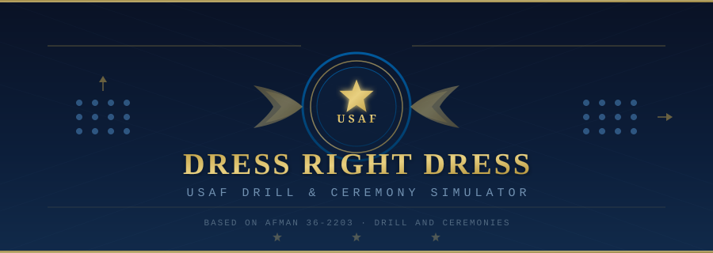

<p align="center">
  
</p>

<p align="center">
  <em>A timed command-selection game for learning USAF drill and ceremony procedures</em>
</p>

<p align="center">
  
  
  
  
</p>

---

## About

**Dress Right Dress** is a graphical training simulator for USAF drill and ceremony commands based on **AFMAN 36-2203** (*Drill and Ceremonies*). Players are presented with formation scenarios — standing or marching — and must select the correct command under time pressure.

Five difficulty levels correspond to leadership positions from Element Leader to Wing Commander. Higher positions earn more points but give you far less time to respond.

## Features

- **27 scenario questions** across 5 categories: Facing Movements, Honors & Salutes, Rest Positions, Formation, and Marching
- **5 difficulty levels** with decreasing response times (14s → 3s)
- **Top-down formation diagram** with compass rose, directional arrows, and animated marching indicators
- **Countdown timer** with color-coded urgency (green → amber → red)
- **Scoring system** with time bonuses for fast answers and streak tracking
- **After-action report** with grade, score breakdown, and question-by-question review
- **Keyboard and mouse** input — press `1`–`4` or click to answer

## Requirements

- Python 3.8 or later
- Pygame 2.0 or later

## Installation

1. Clone the repository:

   ```bash
   git clone https://github.com/jlisic/dress_right_dress.git
   cd dress_right_dress
   ```

2. Install Pygame:

   ```bash
   pip install pygame
   ```

3. Run the simulator:

   ```bash
   python dress_right_dress.py
   ```

## How to Play

### Select Your Position

On the main menu, choose a difficulty level by clicking or pressing `1`–`5`:

| Position              | Time Limit | Points | Difficulty |
|-----------------------|:----------:|:------:|:----------:|
| Element Leader        |    14 s    |   10   |     ■      |
| Flight Commander      |    10 s    |   20   |    ■■      |
| Squadron Commander    |     7 s    |   35   |   ■■■      |
| Group Commander       |     5 s    |   50   |  ■■■■      |
| Wing Commander        |     3 s    |   75   | ■■■■■      |

### Answer Scenarios

Each round presents:

- A **formation diagram** showing the current state (standing/marching, facing direction)
- A **situation description** explaining what you need the formation to do
- **Four command options** — only one is correct per AFMAN 36-2203

Select the correct command before time runs out. After answering, a detailed **explanation** is shown citing the relevant regulation.

### Controls

| Input                        | Action              |
|------------------------------|----------------------|
| `1` `2` `3` `4`             | Select option 1–4    |
| Click on option button       | Select that option   |
| `Enter` / `Space` / `N`     | Advance to next round|
| Close window                 | Quit                 |

### Scoring

- **Base points** are awarded for a correct answer (varies by difficulty)
- **Time bonus** — up to 50% extra points for answering quickly
- **Streaks** are tracked; your best streak appears in the after-action report
- **Final grade** is assigned based on accuracy:

| Accuracy | Grade              |
|:--------:|--------------------|
|  ≥ 90%   | Outstanding        |
|  ≥ 80%   | Excellent          |
|  ≥ 70%   | Satisfactory       |
|  ≥ 50%   | Needs Improvement  |
|  < 50%   | Unsatisfactory     |

## Command Categories

### Facing Movements

Right FACE, Left FACE, About FACE — 90° and 180° turns from a standing position.

### Honors & Salutes

Present ARMS, Order ARMS, Eyes RIGHT, Ready FRONT — rendering and terminating salutes and honors.

### Rest Positions

Parade REST, AT EASE, REST, ATTENTION — the graduated levels of rest within a formation, each with distinct rules about movement and talking.

### Formation

FALL IN, Open/Close Ranks MARCH, DRESS RIGHT DRESS — forming the unit, spacing for inspection, and aligning the formation.

### Marching

Forward MARCH, HALT, Half Step, Mark Time, Column Right/Left, Right/Left Flank, To the Rear, Double Time, Quick Time, Change Step — all commands for initiating, adjusting, turning, and halting the march.

## Reference

This simulator is based on **AFMAN 36-2203**, *Drill and Ceremonies*, which governs drill procedures for the United States Air Force. It is intended as an educational training aid and does not replace official instruction.

## License

MIT
